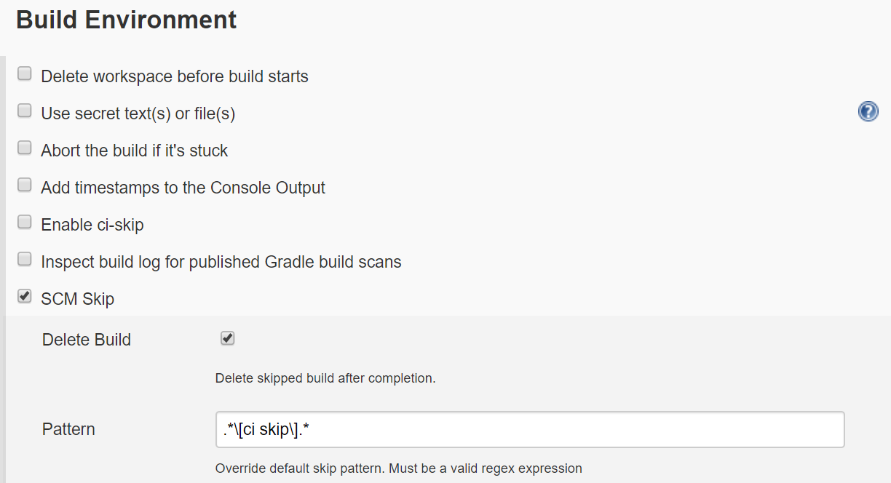

# Jenkins SCM Skip Plugin

Jenkins SCM Skip Plugin checks for matching pattern in scm commit message and aborts current build if it matches.
Plugin can be used in Freestyle Job or in a Pipeline. Additionally, skipped build can be automatically deleted.

## How it works

After SCM checkout SCM Skip plugin checks **last** commit message for specific pattern.
Matching pattern is by default: 

```
.*\[ci skip\].*
```

Pattern can be override in global configuration or for each Job separately.
The pattern must be a valid regex expression.  

If last commit message matches pattern, build is aborted (and deleted if enabled).
For example, a matching message would be: 
- `Updated version. New version: 1.0.1 [ci skip]`
- `[ci skip] Some changes`
- `[ci skip]`

## Global Configuration

Plugin's matching regex pattern can be set in Jenkins Global configuration under "SCM Skip" section.


## Freestyle Job

In Freestyle Job, plugin can be enabled under **Environment** section. 
There are options to delete aborted build and to override matching pattern. See image below.



## Pipeline Job

SCM Skip plugin can also be used in a declarative or a scripted Pipeline Job. 
In this case plugin is available as a build step, with name **scmSkip**.

```Jenkinsfile
    pipeline {
        agent any
        
        stages {
            stage('Checkout') {
                steps {
                    scmSkip(deleteBuild: true, skipPattern:'.*\[ci skip\].*')
                }
            }
        }
    }
```

`deleteBuild` and `skipPattern` are optional parameters. Default value of `deleteBuild` is **false**. 
Default value for `skipPattern` is **null** and matching pattern is read from global configuration.
